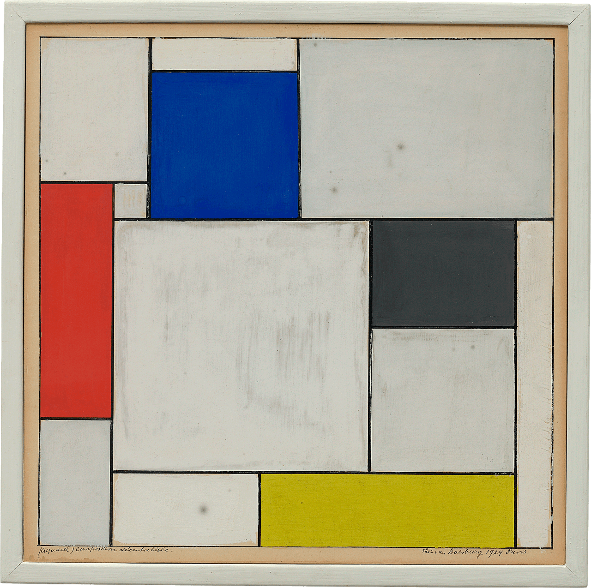

# Assignment 11
## Miya Fordah
#### Padding, Margin, and Borders

Padding is the empty space inside an object, often used to move text away from the edge of a div. The margin is the space outside an object used to keep it from touching other objects. Borders are lined used to visually separate and object from everything else, sitting between the margin and the padding.

#### Original Artwork

#### Work Cycle

For this work cycle I attempted to recreate the Composition Décentralisée by Theo van Doesburg. It is just borders, squares, and rectangles, so I figure it would be pretty easy. I wasn't expecting it to be as difficult as it was to get things next to each other. I'm probably missing something that makes this easier, but I had a tough time with it. It may have been easier if I had chose not to center the whole thing. It made it a lot more difficult as I couldn't use margins very much because they changed too much when I resized the screen. Instead I found myself making a lot of rectangles and using the z coordinate to layer them.

I decided not to do all the smaller rectangles because it was beginning to be a lot of divs, but I think I still achieved the look without them.

I'm not sure if I properly used the display code. I put it in, but I wasn't able to get it to change anything the way I have my divs set up.
